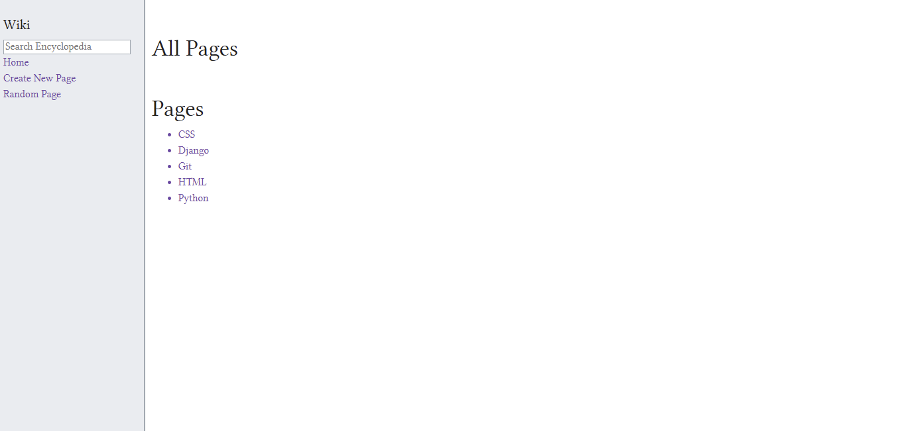
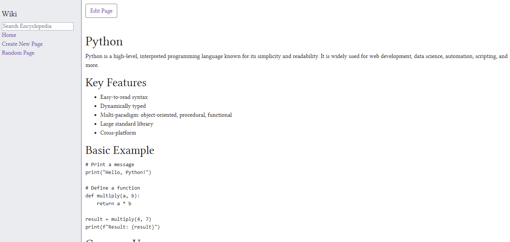
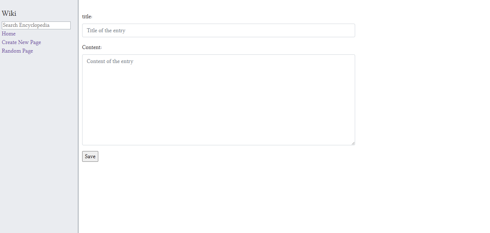
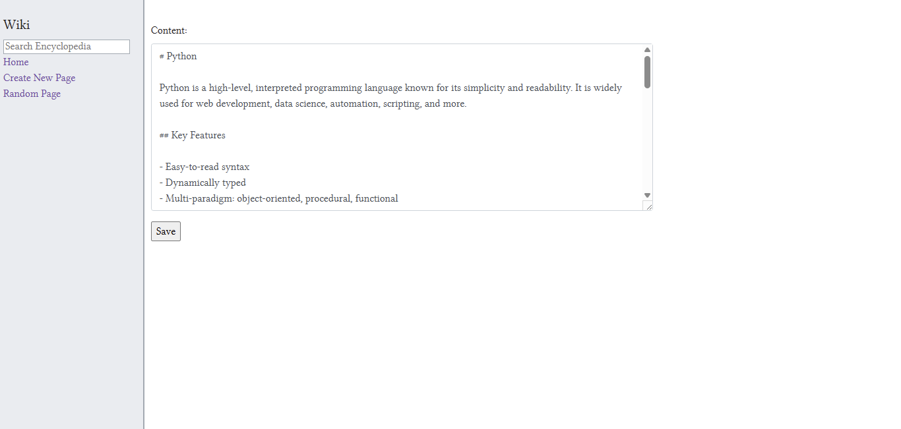

# 📚 Wiki - CS50 Web Programming

🗪 README.md en español: [README_ES.md](README_ES.md)

An online encyclopedia inspired by Wikipedia, developed using Django. Entries are stored in Markdown format and dynamically converted to HTML for display.

---

## 📝 Description

This project implements an interactive web-based encyclopedia with the following features:

* 👁️ Entry display via `/wiki/TITLE`.
* 🗂️ Entry list with links on the homepage.
* 🔍 Search functionality for exact or partial title matches.
* ✍️ Entry creation and editing in Markdown format.
* 🎲 Access to a random entry.
* 🔄 Automatic Markdown to HTML conversion using the `markdown2` library.
* ⚠️ Custom error pages for not found or duplicate entries.

## 📷 Screenshots

### Index Page



### Viewing a Python Entry



### New Entry Form



### Edit Entry Form



## 🏛️ Background

Inspired by [Wikipedia](https://www.wikipedia.org/), this project uses [Markdown](https://help.github.com/en/github/writing-on-github/basic-writing-and-formatting-syntax) instead of Wikitext to store entries. Each entry is a `.md` file located in the `entries/` directory, simplifying content creation and editing. The content is then converted to HTML for browser rendering.

---

## 🗂️ Project Structure

* **`wiki/`**: Django project configuration (`settings.py`, `urls.py`, etc.).
* **`encyclopedia/`**: Main application.

  * `views.py`: View logic and form handling.
  * `urls.py`: Application routes.
  * `util.py`: Utility functions for managing entries (listing, saving, retrieving).
  * `templates/encyclopedia/`:

    * `layout.html`: Base template with sidebar and navigation.
    * `index.html`: Entry list.
    * `entry.html`: Entry display.
    * `new_entry.html`: Entry creation form.
    * `edit_entry.html`: Entry editing form.
    * `error.html`, `404.html`: Custom error pages.
  * `static/encyclopedia/`: CSS and other static assets.
* **`entries/`**: Markdown files for encyclopedia entries.
* **`manage.py`**: Django management script.

---

## ✅ Requirements and Features

* **Entry page**: `/wiki/TITLE` displays the HTML-rendered Markdown content or a 404 error if not found.
* **Index page**: Lists all entries as links to their respective pages.
* **Search**:

  * Exact match redirects to the corresponding entry.
  * Partial match displays a list of results with links.
* **New page**: Form to create entries, with validation to prevent duplicates.
* **Edit page**: Form to modify the Markdown content of an entry.
* **Random page**: Redirects to a randomly selected entry.
* **Markdown to HTML conversion**: Uses `markdown2` to render content. Optionally, manual conversion via regex is supported.

---

## ⚙️ Installation

1. 🌀 Clone the repository:

   ```bash
   git clone https://github.com/Wesleykyle2005/Wiki-Web50
   cd Wiki-Web50
   ```
2. 🛡️ (Optional) Create and activate a virtual environment:

   ```bash
   python -m venv venv
   source venv/bin/activate  # Windows: venv\Scripts\activate
   ```
3. 📦 Install dependencies:

   ```bash
   pip install -r requirements.txt
   ```
4. 🗄️ Apply Django migrations:

   ```bash
   python manage.py migrate
   ```
5. 🚀 Start the development server:

   ```bash
   python manage.py runserver
   ```

---

## 💡 Usage Example

* 🌐 Open `http://127.0.0.1:8000/` in your browser.
* 🔍 Search for entries by name or substring using the sidebar.
* 📝 Create new entries via the "Create New Page" link.
* ✏️ Edit existing entries from their entry page.
* 🎲 Visit a random entry using the "Random Page" link.
* 📁 Entries are stored as `.md` files in the `entries/` directory.

---

## 🏅 Best Practices and Tips

* 🛡️ Use the `|safe` filter in templates to render HTML generated from Markdown: `{{ variable|safe }}`.
* 🗂️ Keep Markdown filenames identical to entry titles to avoid confusion.
* 📖 Refer to [GitHub's Markdown guide](https://help.github.com/en/github/writing-on-github/basic-writing-and-formatting-syntax) to understand supported syntax.
* 🖋️ The project now uses the Linux Libertine font via [cdnfonts](https://www.cdnfonts.com/linux-libertine.font) to resemble Wikipedia's aesthetic.
* 📱 The design is fully responsive using media queries, adapting to desktop, tablet, and mobile devices.
* 🟢 The code has been validated with pylint (10.00/10) and formatted with Black, ensuring professional quality and style.
